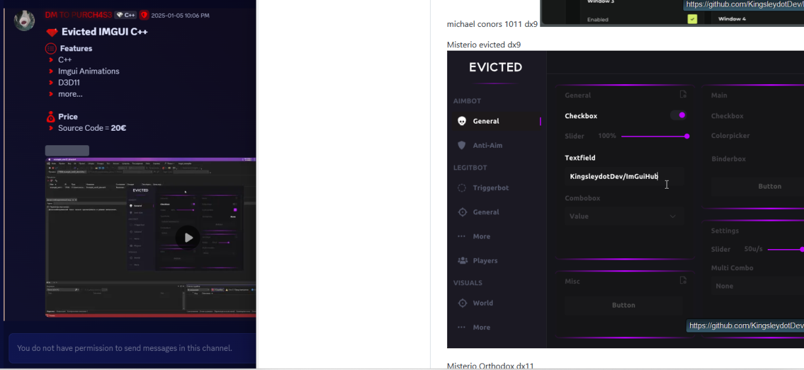
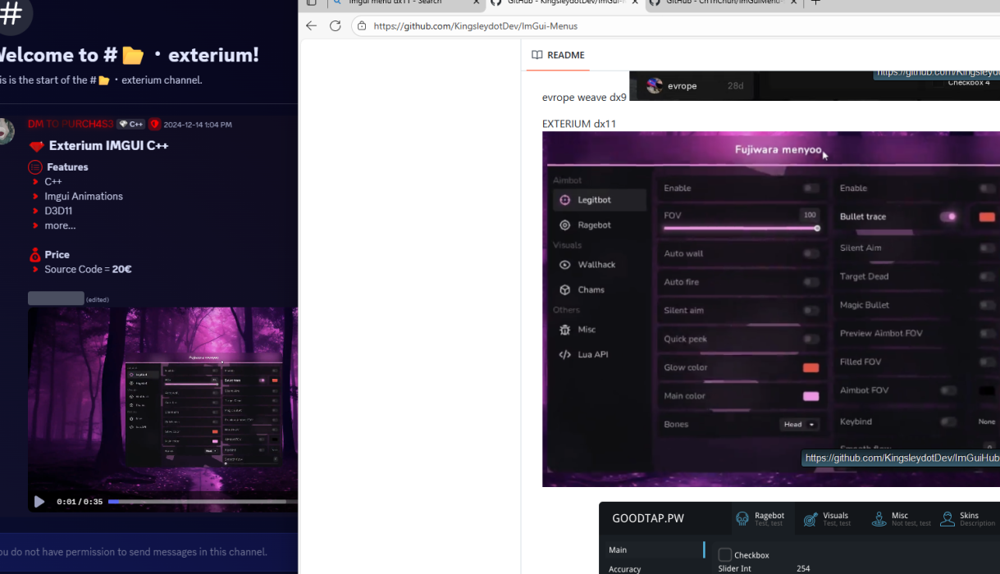
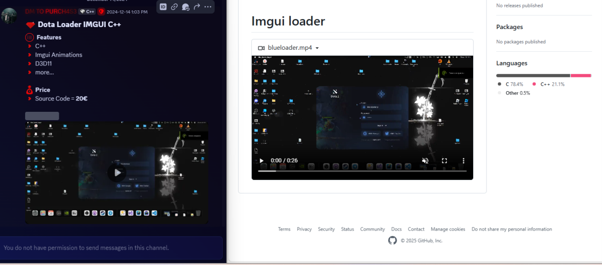
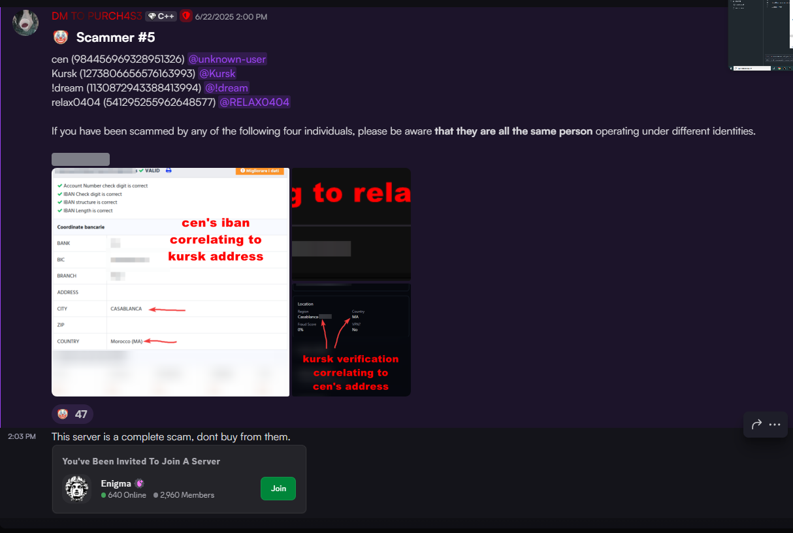
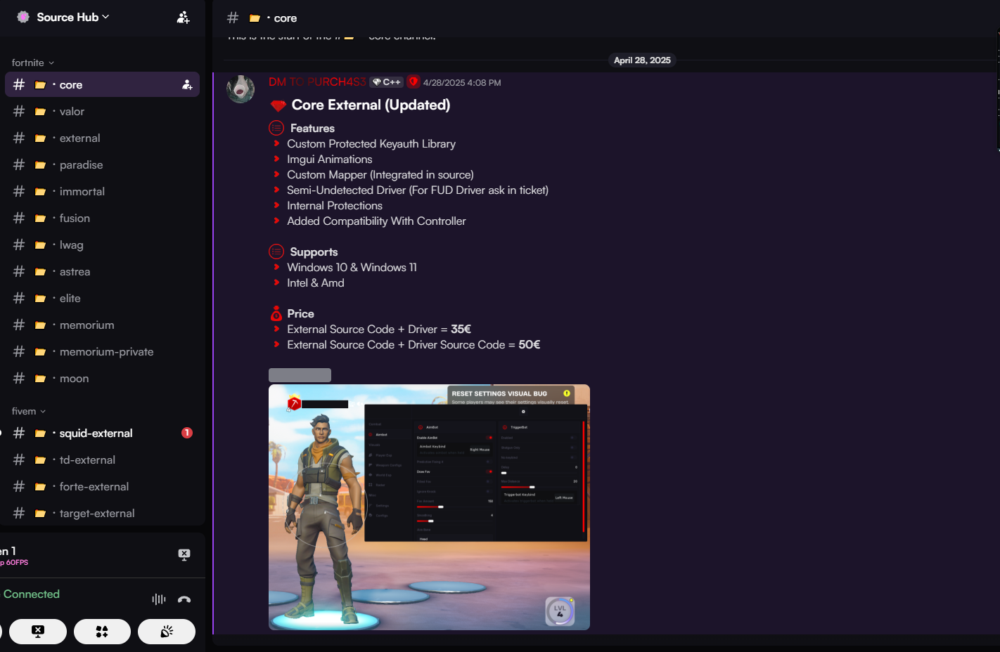

### Exposing UgoPugo / .gg/Source-Hub owner
-1168549810484285562 is his user id if he ever changes his username

he is selling FREE sources that are publicly available on github.

EVERY one of his sources is either leaked or on github </3 

calling other people skids and scammers when his sources are straight off github?

### none of the sources shown down  below in the channels are his or are unleaked

he calls enigma a bunch of scammers yet hes selling their sources🤔

### more sources from enigma / exph

